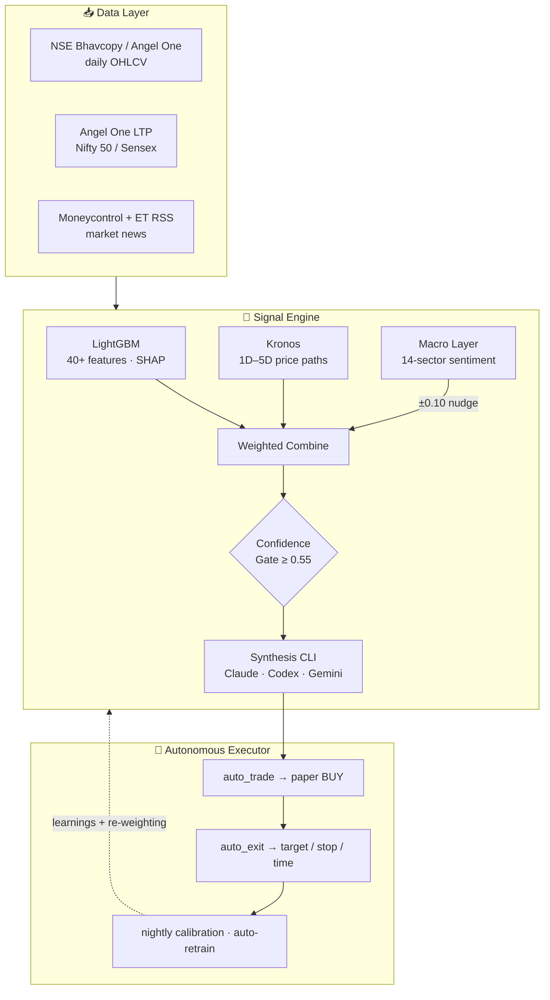
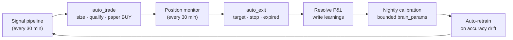

<div align="center">


<a href="https://github.com/harshkawatra11/stocksense">
  
</a>

<br/><br/>


<br/>


<br/><br/>

<a href="#-architecture"><b>Architecture</b></a> &nbsp;·&nbsp;
<a href="#-getting-started"><b>Quickstart</b></a> &nbsp;·&nbsp;
<a href="#-bring-your-own-engine"><b>Engines</b></a> &nbsp;·&nbsp;
<a href="#-api-reference"><b>API</b></a> &nbsp;·&nbsp;
<a href="#-the-autonomous-brain"><b>The Brain</b></a>

</div>

> **StockSense** is a self-running stock-research brain for the Indian market (NSE). Every 30 minutes during market hours it scans ~2,500 tradeable stocks through a four-layer model ensemble, produces BUY signals with a target, a stop, and an expected holding time, paper-trades the strongest ones, and tunes itself on what actually happened — all on your own machine, powered by whichever LLM CLI you already have.

---

## ✨ Highlights

- 🧠 **Four-layer signal ensemble** — LightGBM (40+ features, SHAP) → Kronos time-series forecaster → Qwen-class macro/news layer → an LLM synthesis pass, fused through a confidence-gated combine.
- 🤖 **Fully autonomous** — generates signals, paper-buys, monitors positions, and exits on target / stop / time, every market day. No buttons required.
- 🔌 **Bring your own engine** — the synthesis layer runs on **your** Claude Code, Codex, or Gemini CLI; the macro layer on **local Ollama or Ollama Cloud**. No provider API key is wired in.
- 📈 **Real targets, fractional ETAs** — each signal carries a price target, stop-loss, expected % move, and an interpolated "touches target in ~2.5 days" estimate.
- 🔁 **Compounding learning loop** — resolved trades and EOD reviews become learnings that feed the next cycle; bounded nightly self-calibration; auto-retrain on accuracy drift.
- 👜 **Tracks your real holdings** — sync your broker positions as *watch-only*; the brain reviews and alerts on them but never paper-sells them.
- 🗄️ **~2,475-name tradeable universe** — pruned to live EQ/BE stocks (delisted/suspended tickers removed) so every signal is actually buyable.
- 🖥️ **One-URL local deploy** — backend serves the built frontend at `:8000`; starts itself at login. Every action is logged and auditable.

---

## 📑 Table of Contents

1. [Introduction](#-introduction)
2. [Screenshots](#-screenshots)
3. [Architecture](#-architecture)
4. [Signal Pipeline](#-signal-pipeline)
5. [The Autonomous Brain](#-the-autonomous-brain)
6. [Bring Your Own Engine](#-bring-your-own-engine)
7. [Tech Stack](#-tech-stack)
8. [Project Structure](#-project-structure)
9. [Database Schema](#-database-schema)
10. [Getting Started](#-getting-started)
11. [API Reference](#-api-reference)
12. [Configuration](#-configuration)
13. [Pipeline Schedule](#-pipeline-schedule)
14. [Deployment](#-deployment)
15. [Design & Honesty Notes](#-design--honesty-notes)
16. [Roadmap](#-roadmap)
17. [Acknowledgements](#-acknowledgements)

---

## 🧠 Introduction

Markets speak in candlesticks. StockSense is built to read that language end to end and act on it without a human in the loop. It treats a trading decision as a pipeline: a directional **machine-learning prior**, a **time-series foundation-model** forecast of the price path, a **macro/news** sentiment read of the sector, and a final **LLM synthesis** pass that confirms or rejects each idea — then a paper-trading executor that sizes, holds, and exits positions on its own.

What makes it more than a screener is the loop. Signals are scored against real outcomes, the model-combine weights re-balance on rolling accuracy, end-of-day reviews are written back as learnings that shape the next synthesis prompt, and a conservative nightly calibration nudges the brain's own parameters within hard bounds. It is offline-first and provider-agnostic: clone it, connect a CLI you already pay for, and it runs on your machine.

---

## 🖼️ Screenshots

> Drop PNGs into `docs/screenshots/` to populate this section.

| Brain — autonomy at a glance | Live Signals — actionable BUYs |
| :---: | :---: |
|  |  |
| **Intelligence — four models reasoning** | **Charts — signals on the price** |
|  |  |

---

## 🏗️ Architecture



### Component Stack

| Layer | Technology | Role |
| :--- | :--- | :--- |
| **Database** | TimescaleDB (PostgreSQL) | OHLCV hypertables, signals, portfolio, learnings, brain params |
| **Backend** | Python 3.11 · FastAPI | REST + SSE streaming API; serves the built frontend |
| **Directional prior** | LightGBM | 40+ engineered features, top-5 SHAP reasons per call |
| **Forecaster** | Kronos | Decoder-only time-series foundation model, 1D–5D paths |
| **Macro layer** | Qwen2.5 / Nemotron via **Ollama (local or cloud)** | RSS headlines → 14-sector sentiment |
| **Synthesis** | **Pluggable CLI** — Claude Code · Codex · Gemini | Final confirm/reject + confidence + learnings |
| **Scheduler** | APScheduler (IST) | 12 cron jobs across the market day |
| **Frontend** | React 18 · Vite · Tailwind · lightweight-charts | 8-tab dashboard, live SSE terminals |
| **Data feed** | NSE Bhavcopy · Angel One SmartAPI | Daily OHLCV + live index LTP |

---

## 🔄 Signal Pipeline

`run_pipeline_multi()` fires every 30 minutes during market hours, processes the active universe concurrently (semaphore = 8), and emits **one signal per active timeframe per ticker** (1D / 2D / 3D / 4D / 5D).

```text
For each ticker:
  1. Load ~300 daily OHLCV candles from TimescaleDB
  2. Compute 40+ features ............ RSI · MACD · Bollinger · SMAs · F&O OI/PCR
  3. LightGBM inference .............. (signal, confidence, top-5 SHAP features)
  4. Kronos forecast ................. price path [close_1 .. close_N]
        per timeframe (1D..5D):
          • target  = peak close in the forecast path
          • ETA     = interpolated fractional day the path first crosses target (e.g. 2.5d)
  5. Weighted combine ............... avg(ml_conf, kronos_conf) + macro nudge
        • macro nudge = sector_score ∈ [-1,+1] × macro_nudge_cap (0.10)
        • gate: drop if final_confidence < confidence_threshold (0.55)
  6. Annotate ....................... target_eta_days · expected_move_pct
                                      predicted_path · affordable · shares_affordable
  7. ATR-based stop / 2R target
─────────────────────────────────────────────────────────────────────────────
Batch → Synthesis CLI (top-N + learnings) → CONFIRM / REJECT + final confidence
```

Each stage's reasoning is persisted to `signal_reasoning`, which is what the **Intelligence** tab streams live, model by model.

---

## 🤖 The Autonomous Brain

After every pipeline cycle the brain acts on its own. There are no manual trade buttons.



- **`auto_trade`** — qualifies fresh signals (confidence ≥ threshold, not already held, open positions < max), sizes by `max_position_pct` of cash, records a paper BUY. Idempotent via a `signal_id` pre-check + partial unique index.
- **`auto_exit`** — turns position-monitor `EXIT` verdicts (target hit / stopped / expired) into paper SELLs that realize P&L and resolve the originating BUY.
- **Watch-only real holdings** — sync your actual broker positions with `watch_only = TRUE`; the monitor reviews and alerts on them, but `auto_exit` never closes them.
- **Self-calibration** — a conservative nightly pass proposes bounded changes to `brain_params` (confidence threshold, position size, agreement boost…); unparseable / low-evidence → zero changes, every change audited.
- **Auto-retrain** — rolling accuracy tracker retrains LightGBM when accuracy drifts; `predict.py` hot-reloads the new model on mtime change.
- **Heartbeat** — every scheduled job writes a `job_runs` row so the Brain tab can flag a job that's gone quiet.

---

## 🔌 Bring Your Own Engine

StockSense ships **no provider API key**. On first launch a setup screen connects two pluggable layers; both degrade gracefully if absent.

### Synthesis layer — pick one CLI

| Engine | Install | Log in |
| :--- | :--- | :--- |
|  | `npm i -g @anthropic-ai/claude-code` | run `claude`, then `/login` |
|  | `npm i -g @openai/codex` | `codex login` |
|  | `npm i -g @google/gemini-cli` | run `gemini`, then `/auth` |

Every synthesis call funnels through one adapter (`intelligence/llm_cli.py`) that drives the chosen CLI non-interactively over stdin and maps a **fast** tier (per-signal review) and a **deep** tier (EOD review, calibration, weekend deep-dive) to each provider's models.

### Macro layer — local or cloud

-  &nbsp;free, runs on your machine: `ollama pull qwen2.5:7b`
-  &nbsp;no local GPU: set `OLLAMA_API_KEY` + `OLLAMA_URL` + a hosted `SLM_MODEL` (e.g. Nemotron 3 Ultra)

The choice is saved in the `app_config` table; secrets stay in `.env` only. Re-open the setup screen any time to switch engines.

---

## 🧩 Tech Stack

<div align="center">

**AI / ML**


**Backend · Data · Infra**


**Frontend**


</div>

---

## 📂 Project Structure

```text
stocksense/
├── backend/
│   ├── main.py                      # FastAPI app · SSE stream · serves frontend/dist
│   └── routers/
│       ├── live.py                  # signals · account · activity · reviews · reasoning
│       ├── brain.py                 # autonomy status · params · jobs · equity curve
│       ├── providers.py             # engine status / options / verify / config
│       ├── ohlcv.py · market_*.py   # candles · indices · market overview
│       └── signals.py · portfolio.py · logs.py · accuracy.py
├── intelligence/
│   ├── signal_pipeline.py           # run_pipeline_multi — the core engine
│   ├── macro_context.py             # RSS → sector sentiment (cached 30 min)
│   ├── llm_cli.py                   # pluggable synthesis adapter (claude/codex/gemini)
│   ├── claude_cli.py                # prompt builders + JSON parsing
│   ├── provider_config.py           # active-engine config (app_config + env)
│   ├── auto_trader.py               # auto_trade / auto_exit (watch-only aware)
│   ├── calibration.py · brain_params.py
│   ├── position_monitor.py · trading_account.py · activity.py
├── models/
│   ├── ml/         (train.py · predict.py · retrain_trigger.py)
│   ├── kronos/     (integration.py · combine.py · kronos_repo/)
│   └── slm/        (infer.py · ollama_client.py — local/cloud client)
├── data/
│   ├── db/         (schema.sql … schema_v4_brain.sql · schema_v5_providers.sql · schema_v6_health.sql)
│   └── pipeline/   (fetch_historical_new.py · fetch_angel_daily.py · fetch_groww.py …)
├── scheduler/market_runner.py       # 12 cron jobs (IST)
├── frontend/                        # React + Vite (Brain · Live · Intelligence · …)
│   └── src/components/setup/ProviderSetup.tsx   # first-run engine modal
└── start_stocksense.ps1             # one-shot launcher (Docker + backend + scheduler)
```

---

## 🗄️ Database Schema

<details>
<summary><b>Market data</b></summary>

- **`stocks`** — ticker, name, exchange, `active` (the tradeable universe).
- **`ohlcv_daily`** *(hypertable)* — daily OHLCV across the universe.
</details>

<details>
<summary><b>Signals & reasoning</b></summary>

- **`signals`** — type, timeframe, price/target/stop, `final_confidence`, ETA, predicted path, status, `components_json` (per-component pipeline health snapshot — Stage 0 truth layer).
- **`signal_reasoning`** — per-model reasoning (`lgbm` · `kronos` · `macro` · `claude`/synthesis) for each signal.
- **`learnings`** — EOD-extracted, structured learnings fed back into synthesis.
</details>

<details>
<summary><b>Capital & decisions</b></summary>

- **`account`** — paper cash available / reserve.
- **`portfolio`** — open positions, `avg_price`, `watch_only` flag for real holdings.
- **`decisions`** — BUY/SELL ledger with realized P&L and resolution.
- **`position_reviews`** — re-analysis verdicts (HOLD / EXIT / ADD) with progress.
- **`activity_log`** — full lifecycle feed (SUGGESTED → … → AUTO_SELL, PARAM_CHANGE, RETRAIN).
</details>

<details>
<summary><b>Brain & config</b></summary>

- **`brain_params`** + **`brain_param_history`** — adaptive knobs with hard bounds + audit.
- **`job_runs`** — scheduler heartbeat (running / ok / error + summary).
- **`app_config`** — chosen LLM engines (no secrets).
</details>

---

## 🚀 Getting Started

### Prerequisites

- **Python 3.11+**, **Node.js 18+**, **Docker Desktop** (TimescaleDB + Redis)
- **One synthesis CLI** (Claude Code / Codex / Gemini) + **Ollama** (local) *or* an Ollama Cloud key — see [Bring Your Own Engine](#-bring-your-own-engine)
- *(optional)* a GPU, only if you run the macro layer locally or fine-tune Kronos

### 1 · Clone and configure

```bash
git clone https://github.com/harshkawatra11/stocksense.git
cd stocksense
cp .env.example .env          # fill in DB + (optional) Angel One / Ollama Cloud
pip install -r requirements.txt
```

### 2 · Start the stack

```powershell
./start_stocksense.ps1        # Docker + DB + Redis, backend, scheduler
```

The backend serves the built frontend, so the whole app lives at a single URL: **http://localhost:8000**.

### 3 · Initialize the database

```bash
for v in schema schema_v2_live schema_v3_intelligence schema_v4_brain schema_v5_providers schema_v6_health; do
  docker exec -i stocksense-db-1 psql -U postgres -d stocksense < data/db/$v.sql
done
```

### 4 · Backfill recent prices

```bash
python -m data.pipeline.fetch_historical_new   # NSE Bhavcopy (fast, no auth)
```

### 5 · Open the app

Visit **http://localhost:8000** → the setup screen connects your engines → the **Brain** tab opens. Signals populate automatically during market hours, or trigger a run from the Intelligence tab.

---

## 🧭 API Reference

<details>
<summary><b>Live intelligence — <code>/api/live</code></b></summary>

| Method | Path | Purpose |
| :-- | :-- | :-- |
| GET | `/signals` | actionable BUY signals (target · stop · ETA) |
| GET | `/account` · `/activity` · `/decisions` | capital, lifecycle feed, decision ledger |
| GET | `/positions/reviews` | position re-analysis verdicts |
| GET | `/reasoning` | per-model reasoning trail (Intelligence terminals) |
| GET | `/data-status` · `/mode` | data freshness · paper/live gate |
| POST | `/rate` | human like/dislike feedback |
</details>

<details>
<summary><b>Autonomous brain — <code>/api/brain</code></b></summary>

| Method | Path | Purpose |
| :-- | :-- | :-- |
| GET | `/status` | params, jobs, mode, freshness rollup |
| GET | `/params/history` · `/jobs` | calibration + heartbeat history |
| GET | `/equity` | paper equity curve |
</details>

<details>
<summary><b>Engines — <code>/api/providers</code></b></summary>

| Method | Path | Purpose |
| :-- | :-- | :-- |
| GET | `/status` | active config + installed CLIs + `is_configured` |
| GET | `/options` | catalog with install/login commands |
| POST | `/verify` | real tiny call to prove a CLI works |
| POST | `/config` | persist the chosen engines |
</details>

<details>
<summary><b>Market & streaming</b></summary>

| Method | Path | Purpose |
| :-- | :-- | :-- |
| GET | `/api/ohlcv/{ticker}` · `/api/ohlcv/{ticker}/signals` | candles + signal markers |
| GET | `/api/market/indices` · `/api/market/overview` | index feed · market overview |
| GET | `/api/stream/signals` | SSE per-stage pipeline events |
</details>

---

## ⚙️ Configuration

Key `.env` variables (full list in [`.env.example`](.env.example)):

| Variable | Purpose |
| :--- | :--- |
| `DATABASE_DSN` / `DATABASE_URL` | TimescaleDB connection |
| `OLLAMA_URL` · `SLM_MODEL` · `OLLAMA_API_KEY` | macro layer — local Ollama or Ollama Cloud |
| `LLM_SYNTH_BACKEND` | default synthesis CLI (`claude` / `codex` / `gemini`) |
| `CODEX_*_MODEL` · `GEMINI_*_MODEL` · `CLAUDE_*_MODEL` | per-backend fast/deep models |
| `CONFIDENCE_THRESHOLD` · `MAX_TICKERS_PER_RUN` · `PIPELINE_INTERVAL_MINUTES` | pipeline tuning |
| `UPSTOX_*` | primary live market-data feed (data/pipeline/upstox_client.py) |
| `ANGEL_ONE_*` | fallback-only market-data provider (used if Upstox is unavailable) |
| `GROWW_*` | archived — intraday snapshot path retired, pending resubscription |

---

## ⏰ Pipeline Schedule

All times **IST**, driven by APScheduler in [`scheduler/market_runner.py`](scheduler/market_runner.py).

| Job | Cadence | Does |
| :--- | :--- | :--- |
| `ticker_sync` | daily 08:00 | refresh NSE universe |
| `data_freshness` | Mon–Fri 08:45 | pre-market freshness check |
| `signal_pipeline` + auto-trade | Mon–Fri 09:15 → 15:45, :15/:45 | generate signals, then `auto_trade` |
| `position_review` + auto-exit | Mon–Fri 09:25 → 15:55, :25/:55 | re-analyze positions, then `auto_exit` |
| `refresh_weights` | Mon–Fri 09:05 → 16:05, hourly | re-weight model combine on accuracy |
| `eod_review` | Mon–Fri 15:45 | LLM end-of-day review → learnings |
| `calibration` | Mon–Fri 16:15 | bounded `brain_params` self-tuning |
| `incremental_ohlcv` | Mon–Fri 18:30 | post-close data pull (Upstox primary → NSE Bhavcopy → Angel One fallback) |
| `upstox_bhavcopy_reconciliation` | Mon–Fri 18:35 | warns (non-blocking) if Upstox vs Bhavcopy closes differ >0.1% |
| `incremental_fo` | Mon–Fri 18:45 | post-close F&O data pull |
| `accuracy_tracker` + retrain | Mon–Fri 20:00 | rolling accuracy → auto-retrain |
| `weekend_review` | Sat 09:00 | deep weekly review |

---

## 🚢 Deployment

**Single machine, single URL.** `npm run build` bundles the frontend into `frontend/dist`; the backend serves it, so everything runs from `http://localhost:8000` — no separate dev server. `start_stocksense.ps1` brings up Docker, the backend, and the scheduler, and is registered to run at Windows login, so the brain is live whenever the machine is on.

> **Public hosting** would be a larger lift: multi-tenant data model, auth, cloud compute (the macro/Kronos GPU is the awkward part), a commercial market-data license, and — for publishing signals to others in India — the relevant SEBI considerations. The pluggable-engine work is the first step toward it; the rest is deliberately out of scope for a personal tool.

---

## 🧪 Design & Honesty Notes

- **Paper-mode by default.** Trades are simulated against real prices; a track record must exist before any live execution is considered. The app is decision support, not a broker.
- **Edge is unproven.** This is a research system. In thin periods many signals simply expire without hitting target or stop — calibration deliberately refuses to tune on weak evidence. Treat outputs as hypotheses, not advice.
- **NSE-only.** The universe is NSE cash-equity (EQ/BE). BSE-exclusive names are out of scope by design.
- **Graceful degradation.** No synthesis CLI → that stage is skipped and ML+Kronos+macro still produce signals. No Ollama / no key → neutral macro context. Nothing hard-fails on a missing engine.

---

## 🗺️ Roadmap

- [ ] Upstox live intraday feed (primary) → sub-day timeframes (30m / 2h); Groww archived pending resubscription
- [ ] Auto-trim exits (sell half at first target, trail the rest)
- [ ] Verify Gemini CLI flags + confirm Ollama Cloud model ids
- [ ] Backtest harness with walk-forward, out-of-sample edge reporting
- [ ] Optional multi-tenant hosting path

---

## 🙏 Acknowledgements

- [**Kronos**](https://github.com/shiyu-coder/Kronos) — the open-source foundation model for financial candlesticks that powers the forecasting layer.
- [**Ollama**](https://ollama.com) — local + cloud model serving for the macro layer.
- **Claude Code · Codex · Gemini** CLIs — the interchangeable synthesis engines.

---

<div align="center">


Built by **Harsh Kawatra**

<a href="https://github.com/harshkawatra11"></a>
<a href="https://linkedin.com/in/harshkawatra11"></a>
<a href="mailto:harshkawatra11@gmail.com"></a>

</div>
